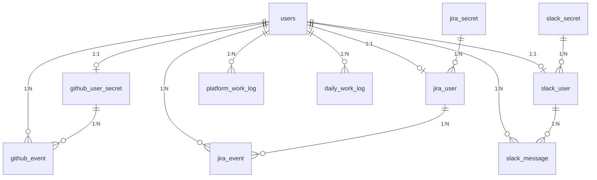
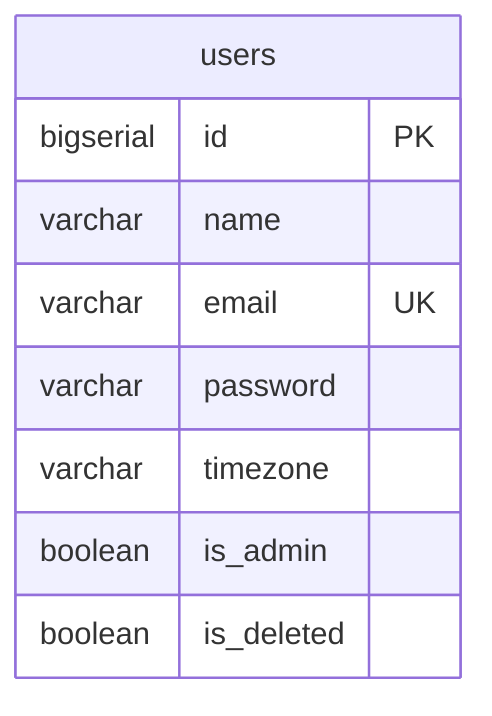
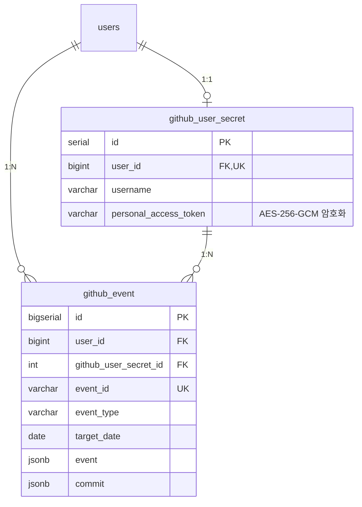
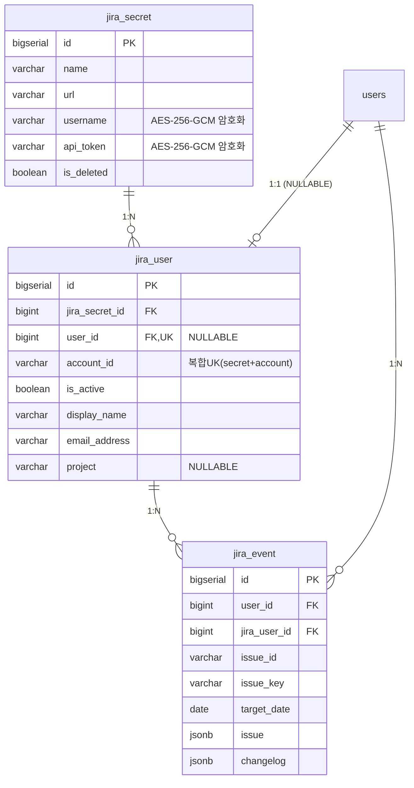
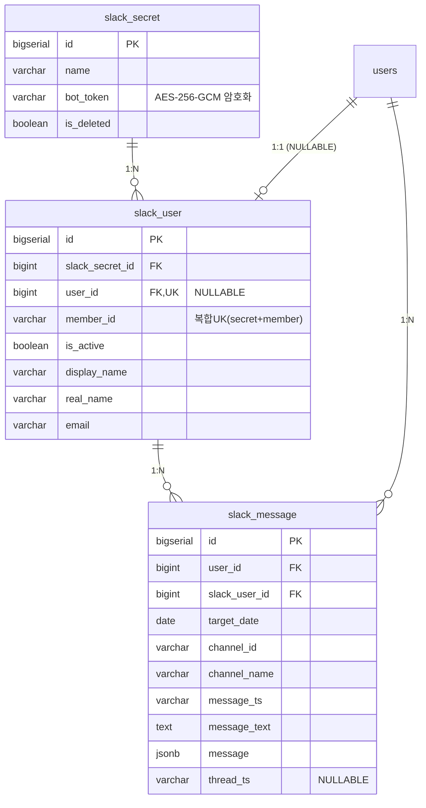
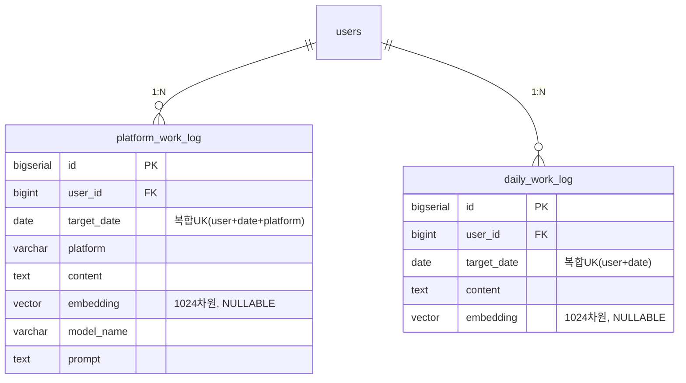

# ERD (Entity Relationship Diagram)

도메인별 데이터 모델 관계도.

> 컬럼 상세는 [DATABASE.md](DATABASE.md) 또는 `docker/postgres/init.sql` 참고.

## 전체 도메인 관계

## 1. 사용자 도메인

## 2. GitHub 도메인

## 3. Jira 도메인

## 4. Slack 도메인

## 5. 업무 일지 도메인

